# LEMP STACK IMPLEMENTATION

## *I started by creating a new EC2 instance of the t2.micro family with Ubunti 20.04 LTS (HVM) image.*

### Step 1 - Install Ngnix Web Server
 The first thing I did after creating the EC2 instance was to install the Ngnix web server.

1. Updated the server's package index

 `sudo apt update` 

 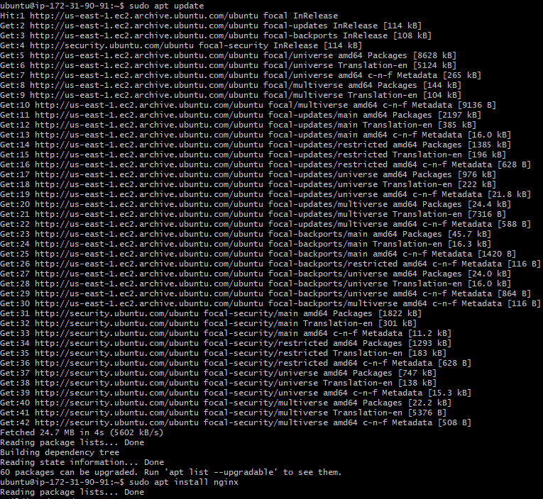

 Then I installed Ngnix

 `sudo apt install nginx`

 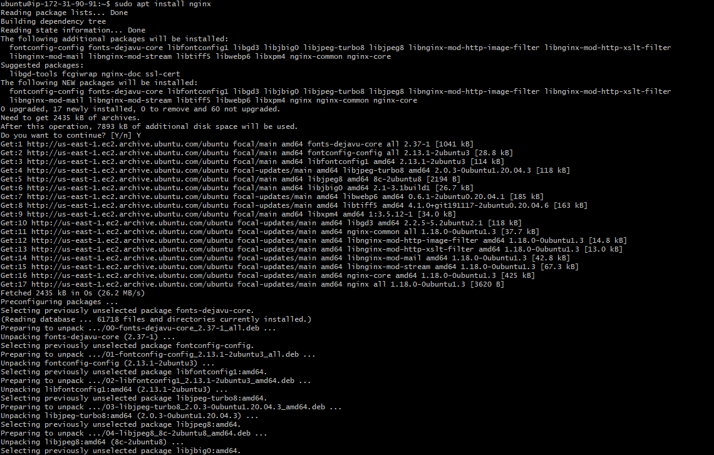

 2. I verified Ngnix installation status

 `sudo systemctl status nginx`

 3. Checking Ngnix server response to request from the internet

 

 ### Step 2 - Installing MySQL

 1. Acquired and Installed MySQL serving using *apt*

 `sudo apt install mysql-server`

 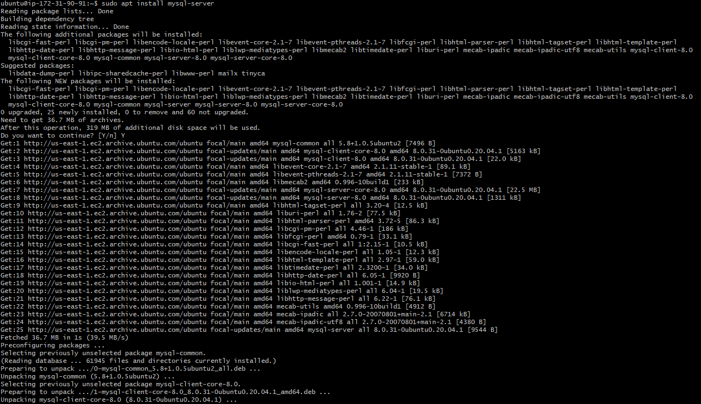

 2. After installing MySQL, I logged into the console and exit

 `sudo mysql`

  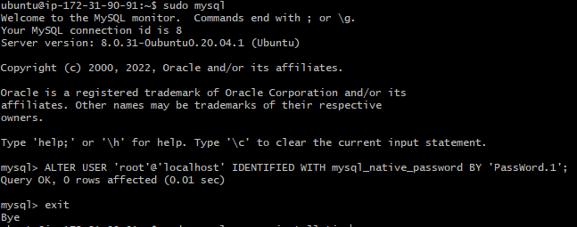

 3. Started Interactive Scripting

  `sudo mysql_secure_installation`

   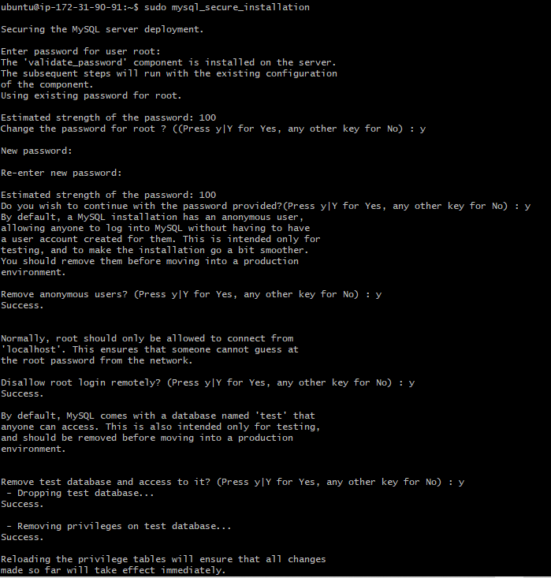

 4. Testing log in to MySQL console

  `sudo mysql -p`

 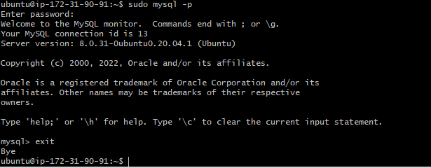

 ### Step 3 - Installing PHP

 1. I installed 2 PHP packages; 
    - php-fpm, which stands for “PHP fastCGI process manager”
    -  php-mysql, a PHP module that allows PHP to communicate with MySQL-based databases

  `sudo apt install php-fpm php-mysql`

  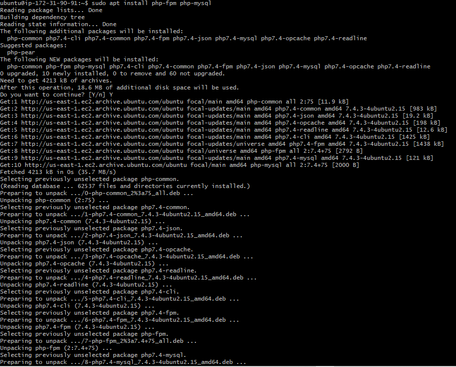

 ### Step 4 - Configuring Ngnix to use PHP Processor

 1. Created a root web directory

 `sudo mkdir /var/www/projectLEMP`

 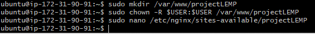

 2. Assign ownership of the directory with the $USER environment variable

 `sudo chown -R $USER:$USER /var/www/projectLEMP`

 3. Open a new configuration file in Ngnix

  `sudo nano /etc/nginx/sites-available/projectLEMP`

 4. Activate configuration by linking to the config file from Nginx’s sites-enabled directory

 `sudo ln -s /etc/nginx/sites-available/projectLEMP /etc/nginx/sites-enabled/`

    Then verify configuration for syntax error
 `sudo nginx -t`

 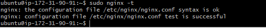

 5. Disable default Ngnix Config host

 `sudo unlink /etc/nginx/sites-enabled/default`

 

 6. Reload Ngnix

 `sudo systemctl reload nginx`

    and create an index.html file in the web root /var/www/projectLEMP

 `sudo echo 'Hello LEMP from hostname' $(curl -s http://169.254.169.254/latest/meta-data/public-hostname) 'with public IP' $(curl -s http://169.254.169.254/latest/meta-data/public-ipv4) > /var/www/projectLEMP/index.html`

 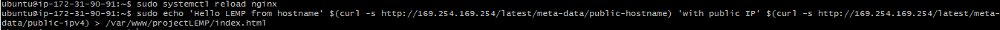

 7. Open Website to verify configuration of Ngnix using Php Processor

 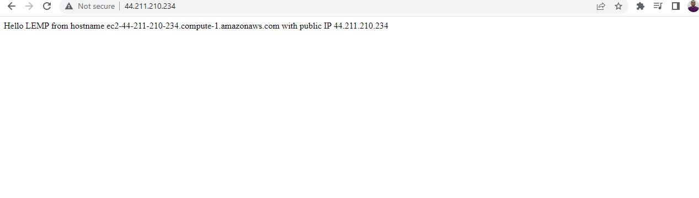

### Step 5 - Testing php with Ngnix

 1. Open a new file within the document root

  `sudo nano /var/www/projectLEMP/info.php`

  

    and test create a test file

 `sudo nano /var/www/projectLEMP/info.php`

 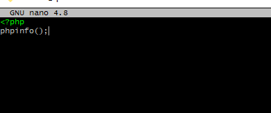

 2. Access the web page in a web browser

 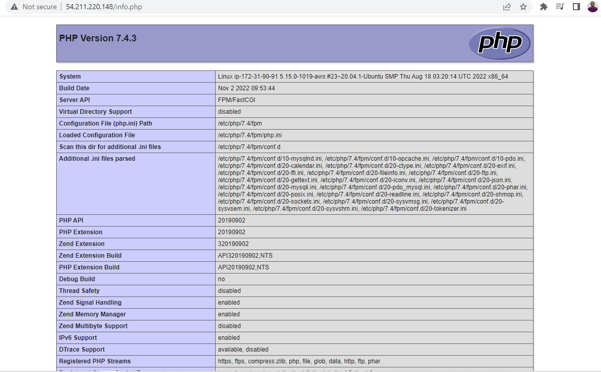

 3. Remove the file containing details about the php server

 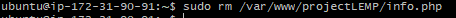

### Step 6 - Retreiving data from MySQL database with Php

 1. Connect to MySQL console

 `sudo mysql -p`

 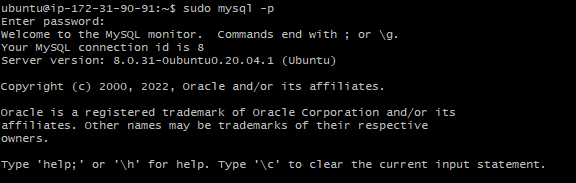

 2. Create a new DB

 `mysql> CREATE DATABASE `example_database`;`

 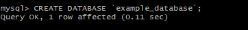

 3. Create a new user and define permission for the new user named example_user

 `mysql> CREATE USER 'example_user'@'%' IDENTIFIED WITH mysql_native_password BY 'Pass.Word@1';`

 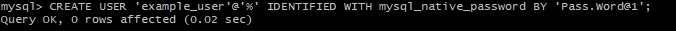

 4. Grant permission to new user and exit

 `mysql> GRANT ALL ON example_database.* TO 'example_user'@'%';`

 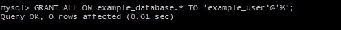

 5. Show database 

 `mysql> SHOW DATABASES;`

 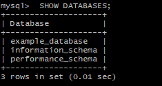

 6. Created a test table named todo_list

  `mysql> CREATE TABLE example_database.todo_list (
    item_id INT AUTO_INCREMENT,
    content VARCHAR(255),
    PRIMARY KEY(item_id)
    );`

 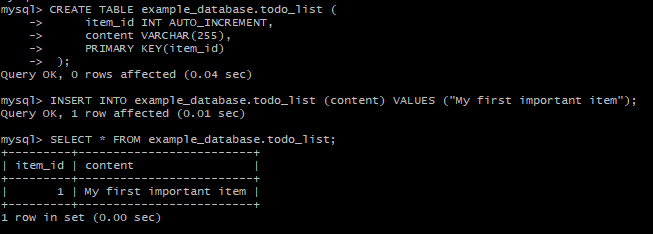

 Add data to the table

 ` INSERT INTO example_database.todo_list (content) VALUES ("My first important item");`

 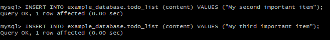

 7. Create a new php file with custom web root directory and add contents to it.

 `nano /var/www/projectLEMP/todo_list.php`
 
 

 8. Verify the todo_list web page

  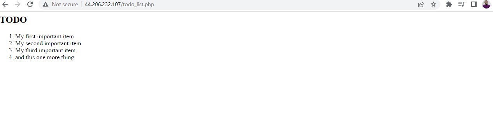

  
